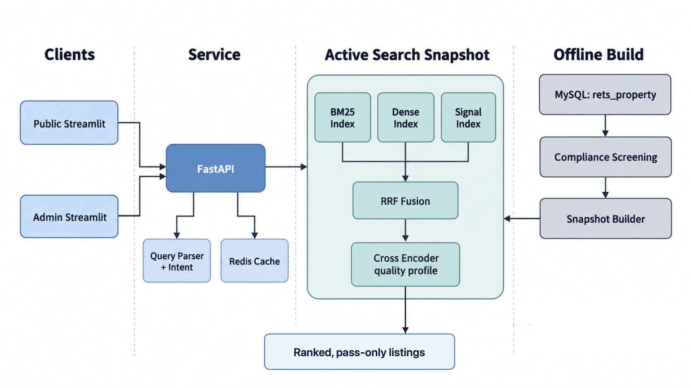
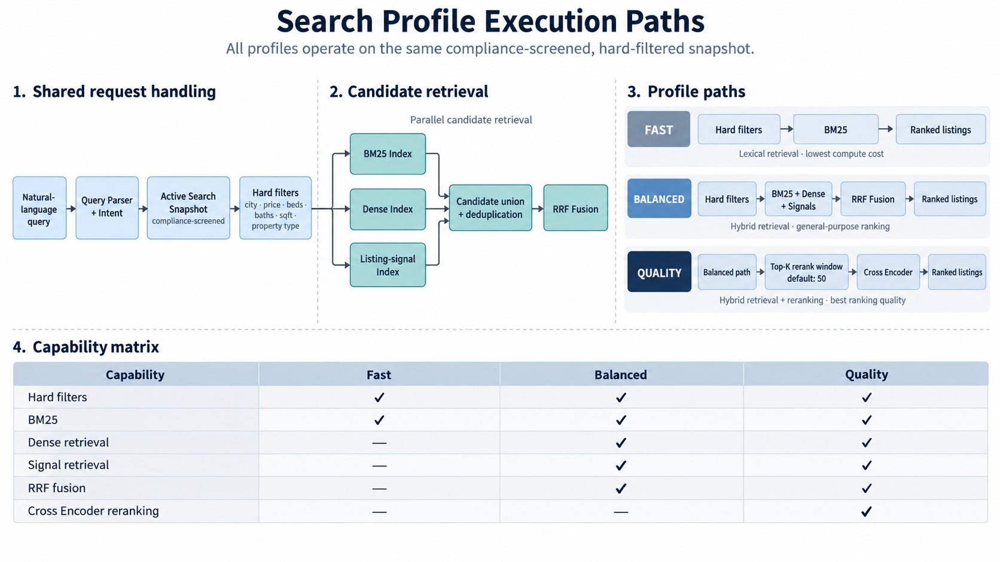

# Intelligent Home Search System

[Live search](https://146-235-204-68.nip.io) | [Reproducibility](#reproducibility-instructions) | [Architecture](#architecture-overview) | [API](#api)

An IDX Exchange product for natural-language search across active California residential listings. The system converts a buyer request into structured constraints, retrieves from a compliance-screened catalog, and ranks results with lexical, semantic, and listing-signal evidence.

This repository contains the full product path: data-derived search artifacts, a FastAPI service, public and administrator Streamlit workspaces, Docker deployment configuration, evaluation notebooks, and tests.

## Core Capabilities

- Parses city, price, beds, baths, square footage, property type, and preference signals from conversational queries.
- Applies explicit hard filters before retrieval and treats amenities, views, pools, fireplaces, and other ambiguous preferences as ranking signals.
- Supports three retrieval profiles: lexical BM25, reciprocal-rank fusion, and fusion with Cross Encoder reranking.
- Builds an immutable, pass-only search snapshot from MLS records. Each snapshot bundles the public catalog, summaries, compliance audit, and retrieval indexes.
- Produces concise listing summaries, exposes original listing descriptions, classifies search intent, and records privacy-preserving product telemetry.
- Screens listing remarks against the versioned `federal-1.1` Fair Housing rule set before a listing enters the public index.

## Architecture Overview



The snapshot builder reads `rets_property`, applies the compliance policy, normalizes the remaining records, extracts listing signals, generates summaries, and writes versioned artifacts under `data/models/`. The API only serves the activated snapshot; it does not query raw listing remarks on the request path. Caddy terminates HTTPS in production, while FastAPI remains internal to the host.

## Search Profiles

| Profile | Retrieval path | Intended use |
| --- | --- | --- |
| `fast` | BM25 lexical retrieval | Lowest compute cost and quickest response |
| `balanced` | Dense, BM25, and listing-signal candidates fused with RRF | General-purpose search |
| `quality` | `balanced` retrieval followed by Cross Encoder reranking | Best ranking quality; default profile |



## Evaluation

The reported results below use frozen local evaluation assets. They are useful regression baselines, not production SLAs.

| Area | Evaluation set | Result |
| --- | --- | --- |
| End-to-end search | 12 held-out queries | Quality: Precision@5 `0.867`, NDCG@5 `0.901`, MRR@5 `0.917` |
| Query parsing | 120 labeled queries | Hard-filter exact match `1.000`; soft-signal exact match `1.000`; full match `0.917` |
| Listing signals | 200 reviewed listings | Structured-field accuracy `1.000`; free-text F1 `0.799`; keyword integrity `1.000` |
| Intent classification | 72 held-out queries | Accuracy `0.958` |
| Compliance screening | 264 local evaluation items | Known-violation recall `1.000`; actionable-alert precision `1.000` |

On the deployed VM, warmed cache hits measured roughly 67-78 ms P50 across profiles. A quality-profile cache miss measured about 4.1 s P50 because Cross Encoder reranking is serialized on the current CPU deployment. The [search-service report](docs/week10_report.md), [product evaluation](notebooks/11_product_integration_evaluation.ipynb), and [deployment validation](docs/week12_report.md) document the methodology and trade-offs.

## Repository Map

```text
.
├── data/
│   ├── raw/              # Local MLS exports; excluded from version control
│   ├── processed/        # Versioned taxonomy, city vocabulary, and query labels
│   └── models/           # Local snapshots, indexes, and trained artifacts
├── docs/                 # Design notes, evaluation reports, and runbooks
├── infra/                # Compose, containers, proxy, database, and environment templates
├── notebooks/            # Exploratory work and reproducible evaluation runs
├── requirements/         # API and web dependency definitions
├── scripts/              # Artifact building, evaluation, and operational entry points
├── src/
│   └── real_estate_nlp/  # Reusable NLP, retrieval, snapshot, and FastAPI code
├── tests/                # Unit, integration, API, retrieval, and web tests
├── web/                  # Streamlit public and administrator interface
└── README.md
```

## Reproducibility Instructions

### Local Setup

Prerequisites:

- Python 3.11
- Conda or another Python environment manager
- Docker Compose
- A local `rets_property.sql` export under `data/raw/` (not included in this repository)

Create the development environment:

```bash
conda create -n idx-nlp python=3.11
conda activate idx-nlp
pip install -r requirements/api_development.txt
```

Place the MLS export at:

```text
data/raw/rets_property.sql
```

Start MySQL and Redis. MySQL loads files in `data/raw/` only when its data volume is created for the first time.

```bash
docker compose -f infra/compose/development.yml up -d mysql redis
docker compose -f infra/compose/development.yml ps
```

Build the two runtime artifacts required by the API. The snapshot command performs the compliance screening and creates the dense, BM25, and signal indexes from the local database.

```bash
python scripts/train_query_intent_classifier.py
python scripts/build_search_snapshot.py
```

Start the complete local stack:

```bash
docker compose -f infra/compose/development.yml up --build
```

Open the public workspace at `http://127.0.0.1:8501`, the local administrator workspace at `http://127.0.0.1:8502`, and OpenAPI at `http://127.0.0.1:8000/docs`.

For an interactive web-only iteration, keep the API running and use:

```bash
pip install -r requirements/web.txt
cd web
PYTHONPATH=.. streamlit run app.py
```

### API

Interactive API documentation is available from the running service at `/docs`. The primary routes are:

| Route | Purpose |
| --- | --- |
| `POST /search` | Parse a query, apply filters, retrieve, rerank, and return paginated listings |
| `GET /listings/{listing_id}` | Return public fields for one listing |
| `POST /listings/details` | Batch-load public listing details and original remarks |
| `POST /parse-query` | Return structured filters, soft signals, and validation output |
| `POST /summarize` | Generate a listing-facing summary |
| `POST /check-compliance` | Screen text using the configured Fair Housing rule set |
| `GET /health`, `GET /ready` | Liveness and artifact-readiness checks |

`/search` accepts `profile=fast|balanced|quality`. Production keeps the API off the public network; the web services access it over the Docker network, and operators use an SSH tunnel when direct API access is needed.

### Public Deployment

The production topology is defined in `infra/compose/production.yml`: Caddy, public/admin web services, FastAPI, MySQL, and Redis. Copy `infra/env/production_template.env` to the ignored `infra/env/production.env`, populate secrets, and run:

```bash
docker compose -p idx-nlp-internship \
  --env-file infra/env/production.env \
  -f infra/compose/production.yml \
  up -d --build --remove-orphans
```

The public deployment uses a validation hostname; a stable owned domain and reserved IP are the remaining production hardening steps. The administrator workspace is protected by Caddy Basic Auth. Deployment rationale and release checks are recorded in [Week 12](docs/week12_report.md).
